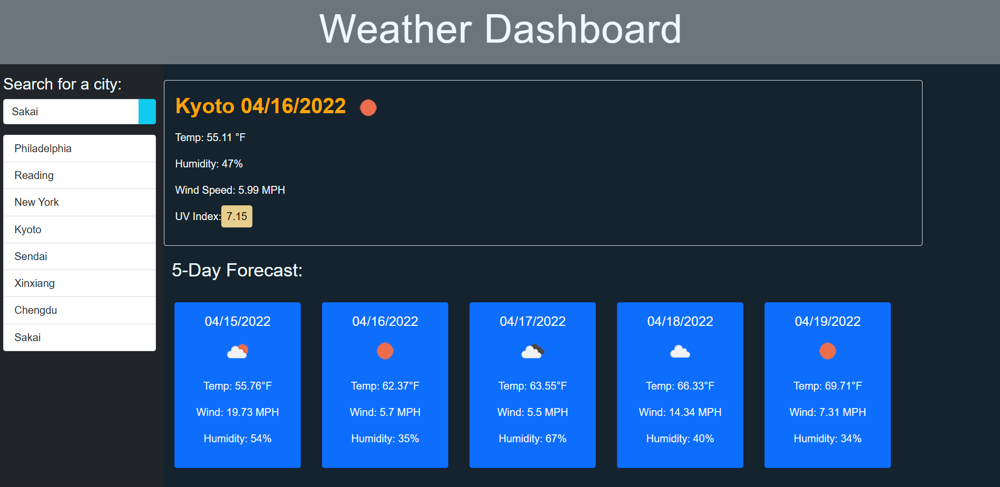

# weather-dashboard
A simple dashboasrd displaying the current weather of a city user(s) have input. It'll also display the next 5 day forecast of the city. 

## Technologies Used
* HTML 
* CSS
* JavaScript
* Bootstrap
* Jquery
* Moment.js
* OpenWeather API 
## How Does It Function?
User(s) is to enter a valid name of specific city to check on today's weather forecast, which will shown on the largest card that appears on the page. It'll include a specific icon that represents the current forecast, along with the predicted temperature, wind, humidity, and UV index. 
The UV index will change into 3 colors based on the weather conditions:
* Pastel Green = favorable
* Pastel Yellow-Orange = moderate
* Pastel Red = severe

Additional 5 cards will also appear below the current forecast date, enabling user(s) to view the city's next 5-day forcast.  

All the search history will be saved below the input text box and the forecast can be viewed again.
## URL
Deployed: https://binnie51.github.io/weather-dashboard/

## Screenshot


## Acceptance Criteria

```
GIVEN a weather dashboard with form inputs
WHEN I search for a city
THEN I am presented with current and future conditions for that city and that city is added to the search history
WHEN I view current weather conditions for that city
THEN I am presented with the city name, the date, an icon representation of weather conditions, the temperature, the humidity, the wind speed, and the UV index
WHEN I view the UV index
THEN I am presented with a color that indicates whether the conditions are favorable, moderate, or severe
WHEN I view future weather conditions for that city
THEN I am presented with a 5-day forecast that displays the date, an icon representation of weather conditions, the temperature, the wind speed, and the humidity
WHEN I click on a city in the search history
THEN I am again presented with current and future conditions for that city
```

## License
Copyright (c) Vincent Tjia. All rights reserved.
License under MIT